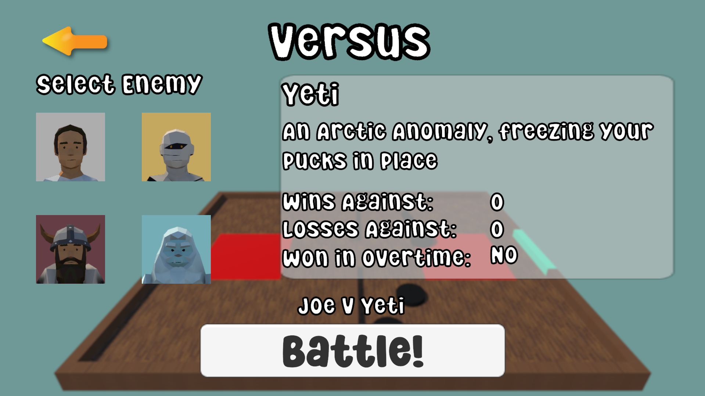

Battle against multiple characters in an action-packed physics-based puck game! Play in a 1 minute face off against your opponent

This game was developed as part of a course on game development by the UCSB Gaucho Game Lab.

Available on itch.io [here](https://drikdrok.itch.io/puck-battle)

  
   
  

